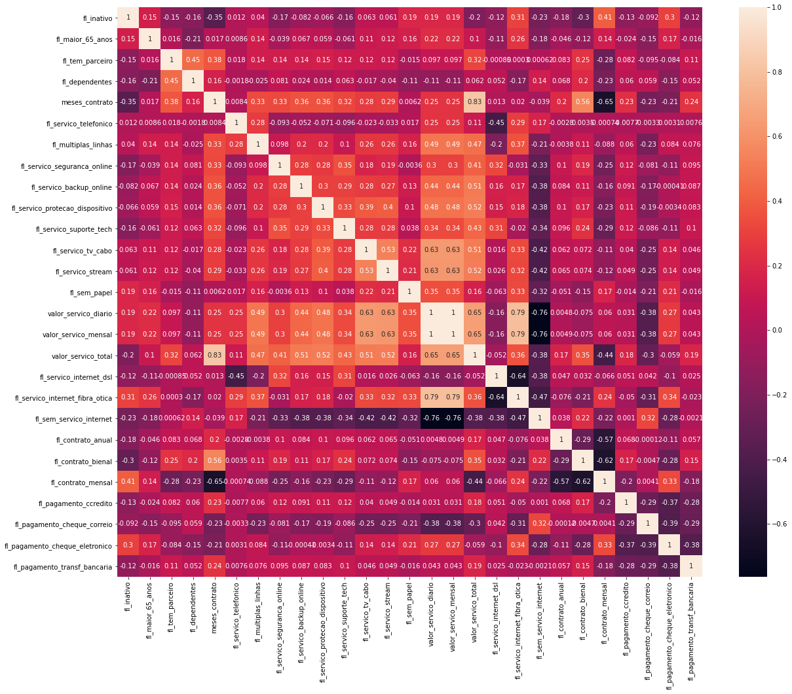
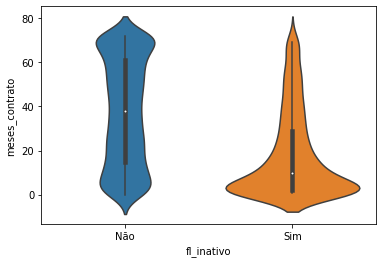
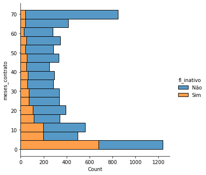

[](https://github.com/exata0mente/Challenge-Data-Science-Allura/pulse)

# Challenge: Data Science Allura

Neste repositório postarei o meu progresso no [Challenge de DataScience da Alura](https://www.alura.com.br/challenges/data-science)

O progresso estará, inicialmente, separado em pastas de Semanas.

## O desafio!

Você foi contratado(a) como **cientista de dados** pela operadora de telecomunicações **Alura Voz**. Na reunião inicial com as pessoas responsáveis pela área de vendas da empresa, foi explicada a importância de se **reduzir a Taxa de Evasão** de Clientes, conhecido como **Churn Rate**. Basicamente, o Churn Rate indica o quanto a empresa perdeu de receita ou clientes em um período de tempo.

Com sua experiência, você sugere, como passo inicial, a identificação de clientes que teriam uma maior chance de deixar a empresa. Para isso, você explica que é interessante investigar algumas características de clientes ou dos planos de clientes para tentar **CLASSIFICAR** estas pessoas como potenciais candidatas a deixar a empresa ou não.

Assim, você solicita o conjunto de dados para começar a explorar, tratar e modelar a partir de agora. Em seguida, o foco será na otimização de cada um dos modelos com a finalidade de obter o melhor resultado para a tomada de decisão da **Alura Voz**. 

Por fim, você vai utilizar o **GitHub** e desenvolverá um **portfólio** focado em Data Science e Machine Learning.

O desafio será divido em 4 partes (semanas):

1. [**Análise exploratória dos dados**](#parte-1-análise-exploratória-dos-dados)
1. [**Visualização dos dados**](#parte-2-visualização-dos-dados)
1. **Modelagem de _Machine Learning_**
1. **Apresentação e portifólio**

Abaixo destaco os pontos importantes de cada uma das etapas.

## Etapas

### Parte 1: Análise exploratória dos dados

#### A base de dados

A base disponibilizada contem dados dos clientes da Alura Voz, como ja citado, com algumas quebras:

- **Dados do consumidor**: Sexo, dependentes, parceiros, flag de maior de 65 anos e tempo de contrato
- **Serviço telefônico**: Se possui o serviço e se possui mais de uma linha
- **Serviço de internet**: Tipo de serviço e produtos atrelados
- **Conta**: Tipo do contrato, metodo de pagamento e valores

O dicionário de dados está localizado em https://github.com/sthemonica/alura-voz/blob/main/dicionario.md

#### Ferramentas utilizadas
- `pandas` 
- `numpy`

#### O desenvolvimento

Esta etapa basicamente foi focada na normalização, tradução e limpeza dos dados.

A normalização foi necessária pois a [base inicial](https://raw.githubusercontent.com/sthemonica/alura-voz/main/Dados/Telco-Customer-Churn.json) está no formato *JSON*  (que é uma estrutura que, dentre várias facilidades, permite 'aninhar' valores) para um formato tabular.

De

```JSON
{
  "customerID": "0002-ORFBO",
  "Churn": "No",
  "customer": {
    "gender": "Female",
    "SeniorCitizen": 0,
    "Partner": "Yes",
    "Dependents": "Yes",
    "tenure": 9
  },
  "phone": {
    "PhoneService": "Yes",
    "MultipleLines": "No"
  },
  "internet": {
    "InternetService": "DSL",
    "OnlineSecurity": "No",
    "OnlineBackup": "Yes",
    "DeviceProtection": "No",
    "TechSupport": "Yes",
    "StreamingTV": "Yes",
    "StreamingMovies": "No"
  },
  "account": {
    "Contract": "One year",
    "PaperlessBilling": "Yes",
    "PaymentMethod": "Mailed check",
    "Charges": {
      "Monthly": 65.6,
      "Total": "593.3"
    }
  }
}
```

Para

| **customerID** | **Churn** | **gender** | **SeniorCitizen** | **Partner** | **Dependents** | **tenure** | **PhoneService** | **MultipleLines** | **InternetService** | **OnlineSecurity** | **OnlineBackup** | **DeviceProtection** | **TechSupport** | **StreamingTV** | **StreamingMovies** | **Contract** | **PaperlessBilling** | **PaymentMethod** | **Charges.Monthly** | **Charges.Total** |
|:--------------:|:---------:|:----------:|:-----------------:|:-----------:|:--------------:|:----------:|:----------------:|:-----------------:|:-------------------:|:------------------:|:----------------:|:--------------------:|:---------------:|:---------------:|:-------------------:|:------------:|:--------------------:|:-----------------:|:-------------------:|:-----------------:|
| 0002-ORFBO     | No        | Female     | 0                 | Yes         | Yes            | 9          | Yes              | No                | DSL                 | No                 | Yes              | No                   | Yes             | Yes             | No                  | One year     | Yes                  | Mailed check      | 65.600000           | 593.300000        |

Em seguida realizamos a tradução das colunas, para uma menor carga cognitiva na interpretação das colunas e depois alguns tratamentos necessários, sendo eles limpeza de dados faltantes, entendimento de algumas distribuições e correção de alguns valores.

Após a normalização a base de dados possui 7267 linhas e 22 colunas.

#### Resultados

Os resultados dos tratamentos podem ser encontrados na pasta de [Dados](Dados/), contendo duas bases, [com](Dados/dados_tratados_sem_traducao.json) e [sem tradução](Dados/dados_tratados.json)

Todo o desenvolvimento realizado pode ser encontrado no notebook [Base de Dados - Churn.ipynb](./Semana 1/Base de Dados - Churn.ipynb)

#### Conclusão

Pude concluir nesta etapa a importância da organização dos dados, a análise de cada variável (processo que pode ser automatizado) e o decisão sobre os dados faltantes (limpar ou não limpar? eis a questão...)

#### To-do list
- [ ] Trazer ao README.md alguns números e visuais da base tratada.

### Parte 2: Visualização dos dados

Com os dados devidamente tratados, vamos fazer uma análise visual e trazer algumas hipóteses referente ao _churn_

#### Ferramentas utilizadas

- `pandas` 
- `seaborn`
- `matplotlib.pyplot`

#### O desenvolvimento

Nesta etapa dei visualização principalmente as distrubuições de frequência das variáveis. Primeiramente entre elas e em seguida em relação ao churn. Lembrando que na base possuia [diversas informações](#a-base-de-dados) sobre o cadastro do cliente na **Alura Voz**, dando a possibilidade de realizar as relações com a variável em questão.

#### Resultados

Dentre as várias análises realizadas, que podem ser encontradas [aqui](./Semana 2/), atráves da Matriz de Correlação, identificamos 4 variávies que apresentaram uma correlação considerável:



##### Tipo de contrato: mensal

A variável referente a contrato mensal indicou uma correlação com a variável de churn. Lembrando que para tipo de contrato temos as opções de Mensal, Anual e Bienal.

Nossos clientes com **contratos curtos estão mais propensos ao churn**. Esta opção de contrato pode ser tirada do portifólio ou devemos melhorar as condições?

##### Tipo de internet: produto Fibra Ótica

A variável de produto Fibra Ótica também indicou propenção ao churn. Importante notar que esse produto tem correlação positiva com as variáveis de valores pagos. Ou seja, é um produto caro que o cliente não está conseguindo pagar ou o produto não está se justificando

##### Tipo de pagamento: cheque eletrônico

Este tipo de pagamento, que tem uma correlação forte com o produto fibra ótica.

Imagino ser potencialmente problematica essa forma de pagamento, a sugestão seria descontinuá-la.

##### Meses de contrato

É possível identificar uma maior distribuição nos clientes _churn_ principalmente em contratos de poucos meses




A correlação é negativa, o que faz sentido se analisarmos a relação com o tipo de contrato mensal.

#### Conclusão

Com base nessas constatações, temos 3 frentes que podem ser tomadas:
1. Contrato: Revisão dos termos, preços e multas
1. Pagamento: Atualizar as formas de pagamento para as mais atuais e descontinuar a modalidade de cheque.
1. Produtos: Estudar a qualidade do produto de fibra ótica

A principio, com base nessas pontos, a solução está dentro de casa. Não dá, até o momento, para constatar que um determinado perfil de cliente é propenso ao churn