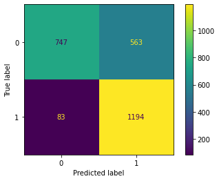

[](https://github.com/exata0mente/Challenge-Data-Science-Allura/pulse)

# TL;DR

Com base nos dados de uma empresa de voz fictícia, **Alura Voz**, realizei um _pipeline_ de modelagem de machine learning, proposto no [Challenge de DataScience da Alura](https://www.alura.com.br/challenges/data-science) para identificar um cliente que potencialmente deixará de usar esse serviço.

Trabalhando com uma base de 7267 linhas e 22 colunas, bibliotecas como `pandas`, `seaborn`, `scikitlearning` e elementos de _storytelling_, identifiquei inicialmente que as **características de clientes que sairám da empresa** estavam mais concentradas no **tipo e tempo de contrato, serviço de fibra ótica e pagamento com cheque eletrônico**.

O modelo selecionado para predição foi o de algoritimo *Random Forrest*, que apresentou métricas de 75% de acurácia e 93% de sensibilidade no treinamento porém, quando utilizado em uma pequena base separada de 224 registros, apresentou uma generalização em um atributo específico (tipo de contrato) mostrando ainda a oportunidade de melhoria no modelo.
 

# Challenge: Data Science Allura

Neste repositório postarei o meu progresso no [Challenge de DataScience da Alura](https://www.alura.com.br/challenges/data-science)

O progresso estará, inicialmente, separado em pastas de Semanas.

## O desafio!

Você foi contratado(a) como **cientista de dados** pela operadora de telecomunicações **Alura Voz**. Na reunião inicial com as pessoas responsáveis pela área de vendas da empresa, foi explicada a importância de se **reduzir a Taxa de Evasão** de Clientes, conhecido como **Churn Rate**. Basicamente, o Churn Rate indica o quanto a empresa perdeu de receita ou clientes em um período de tempo.

Com sua experiência, você sugere, como passo inicial, a identificação de clientes que teriam uma maior chance de deixar a empresa. Para isso, você explica que é interessante investigar algumas características de clientes ou dos planos de clientes para tentar **CLASSIFICAR** estas pessoas como potenciais candidatas a deixar a empresa ou não.

Assim, você solicita o conjunto de dados para começar a explorar, tratar e modelar a partir de agora. Em seguida, o foco será na otimização de cada um dos modelos com a finalidade de obter o melhor resultado para a tomada de decisão da **Alura Voz**. 

Por fim, você vai utilizar o **GitHub** e desenvolverá um **portfólio** focado em Data Science e Machine Learning.

O desafio será divido em 4 partes (semanas):

1. [**Análise exploratória dos dados**](#parte-1-análise-exploratória-dos-dados)
1. [**Visualização dos dados**](#parte-2-visualização-dos-dados)
1. [**Modelagem de _Machine Learning_**](#parte-3-modelo-de-machine-learning)
1. **Apresentação e portifólio**

Abaixo destaco os pontos importantes de cada uma das etapas.

## Etapas

### Parte 1: Análise exploratória dos dados

#### A base de dados

A base disponibilizada contem dados dos clientes da Alura Voz, como ja citado, com algumas quebras:

- **Dados do consumidor**: Sexo, dependentes, parceiros, flag de maior de 65 anos e tempo de contrato
- **Serviço telefônico**: Se possui o serviço e se possui mais de uma linha
- **Serviço de internet**: Tipo de serviço e produtos atrelados
- **Conta**: Tipo do contrato, metodo de pagamento e valores

O dicionário de dados está localizado em https://github.com/sthemonica/alura-voz/blob/main/dicionario.md

#### Ferramentas utilizadas
- `pandas` 
- `numpy`

#### O desenvolvimento

Esta etapa basicamente foi focada na normalização, tradução e limpeza dos dados.

A normalização foi necessária pois a [base inicial](https://raw.githubusercontent.com/sthemonica/alura-voz/main/Dados/Telco-Customer-Churn.json) está no formato *JSON*  (que é uma estrutura que, dentre várias facilidades, permite 'aninhar' valores) para um formato tabular.

De

```JSON
{
  "customerID": "0002-ORFBO",
  "Churn": "No",
  "customer": {
    "gender": "Female",
    "SeniorCitizen": 0,
    "Partner": "Yes",
    "Dependents": "Yes",
    "tenure": 9
  },
  "phone": {
    "PhoneService": "Yes",
    "MultipleLines": "No"
  },
  "internet": {
    "InternetService": "DSL",
    "OnlineSecurity": "No",
    "OnlineBackup": "Yes",
    "DeviceProtection": "No",
    "TechSupport": "Yes",
    "StreamingTV": "Yes",
    "StreamingMovies": "No"
  },
  "account": {
    "Contract": "One year",
    "PaperlessBilling": "Yes",
    "PaymentMethod": "Mailed check",
    "Charges": {
      "Monthly": 65.6,
      "Total": "593.3"
    }
  }
}
```

Para

| **customerID** | **Churn** | **gender** | **SeniorCitizen** | **Partner** | **Dependents** | **tenure** | **PhoneService** | **MultipleLines** | **InternetService** | **OnlineSecurity** | **OnlineBackup** | **DeviceProtection** | **TechSupport** | **StreamingTV** | **StreamingMovies** | **Contract** | **PaperlessBilling** | **PaymentMethod** | **Charges.Monthly** | **Charges.Total** |
|:--------------:|:---------:|:----------:|:-----------------:|:-----------:|:--------------:|:----------:|:----------------:|:-----------------:|:-------------------:|:------------------:|:----------------:|:--------------------:|:---------------:|:---------------:|:-------------------:|:------------:|:--------------------:|:-----------------:|:-------------------:|:-----------------:|
| 0002-ORFBO     | No        | Female     | 0                 | Yes         | Yes            | 9          | Yes              | No                | DSL                 | No                 | Yes              | No                   | Yes             | Yes             | No                  | One year     | Yes                  | Mailed check      | 65.600000           | 593.300000        |

Em seguida realizamos a tradução das colunas, para uma menor carga cognitiva na interpretação das colunas e depois alguns tratamentos necessários, sendo eles limpeza de dados faltantes, entendimento de algumas distribuições e correção de alguns valores.

Após a normalização a base de dados possui 7267 linhas e 22 colunas.

#### Resultados

Os resultados dos tratamentos podem ser encontrados na pasta de [Dados](Dados/), contendo duas bases, [com](Dados/dados_tratados_sem_traducao.json) e [sem tradução](Dados/dados_tratados.json)

Todo o desenvolvimento realizado pode ser encontrado no notebook [Base de Dados - Churn.ipynb](./Semana_1/Base de Dados - Churn.ipynb)

#### Conclusão

Pude concluir nesta etapa a importância da organização dos dados, a análise de cada variável (processo que pode ser automatizado) e o decisão sobre os dados faltantes (limpar ou não limpar? eis a questão...)

#### To-do list
- [ ] Trazer ao README.md alguns números e visuais da base tratada.

### Parte 2: Visualização dos dados

Com os dados devidamente tratados, vamos fazer uma análise visual e trazer algumas hipóteses referente ao _churn_

#### Ferramentas utilizadas

- `pandas` 
- `seaborn`
- `matplotlib.pyplot`

#### O desenvolvimento

Nesta etapa dei visualização principalmente as distrubuições de frequência das variáveis. Primeiramente entre elas e em seguida em relação ao churn. Lembrando que na base possuia [diversas informações](#a-base-de-dados) sobre o cadastro do cliente na **Alura Voz**, dando a possibilidade de realizar as relações com a variável em questão.

#### Resultados

Dentre as várias análises realizadas, que podem ser encontradas [aqui](./Semana_2/), atráves da Matriz de Correlação, identificamos 4 variávies que apresentaram uma correlação considerável:


##### Tipo de contrato: mensal

A variável referente a contrato mensal indicou uma correlação com a variável de churn. Lembrando que para tipo de contrato temos as opções de Mensal, Anual e Bienal.

Nossos clientes com **contratos curtos estão mais propensos ao churn**. Esta opção de contrato pode ser tirada do portifólio ou devemos melhorar as condições?

##### Tipo de internet: produto Fibra Ótica

A variável de produto Fibra Ótica também indicou propenção ao churn. Importante notar que esse produto tem correlação positiva com as variáveis de valores pagos. Ou seja, é um produto caro que o cliente não está conseguindo pagar ou o produto não está se justificando

##### Tipo de pagamento: cheque eletrônico

Este tipo de pagamento, que tem uma correlação forte com o produto fibra ótica.

Imagino ser potencialmente problematica essa forma de pagamento, a sugestão seria descontinuá-la.

##### Meses de contrato

É possível identificar uma maior distribuição nos clientes _churn_ principalmente em contratos de poucos meses


A correlação é negativa, o que faz sentido se analisarmos a relação com o tipo de contrato mensal.

#### Conclusão

Com base nessas constatações, temos 3 frentes que podem ser tomadas:
1. Contrato: Revisão dos termos, preços e multas
1. Pagamento: Atualizar as formas de pagamento para as mais atuais e descontinuar a modalidade de cheque.
1. Produtos: Estudar a qualidade do produto de fibra ótica

A principio, com base nessas pontos, a solução está dentro de casa. Não dá, até o momento, para constatar que um determinado perfil de cliente é propenso ao churn.

#### To-do list
- [ ] Trazer ao README.md mais gráficos
- [ ] Melhorar a qualidade dos gráficos (título, borda, eixo, etc)

### Parte 3: Modelo de Machine Learning

Nesta etapa, tendo a base devidamente tratada, iremos iniciar a nossa identificação de um modelo para a predição de churn

#### Ferramentas utilizadas

- `imblearn.over_sampling`: Para o balanceamento dos dados
- `sklearn.model_selection`: Para a separação de amostras de treino e teste
- `sklearn.linear_model`: Para a utilização do modelo `LogisticRegression` (regressão logística)
- `sklearn.tree`: Para a utilização do modelo `DecisionTreeClassifier` (árvore de decisão)
- `sklearn.ensemble`: Para a utilização do modelo `RandomForestClassifier` (árvores randomicas)
- `sklearn.dummy`: Para a utilização do modelo `DummyClassifier` (_baseline_)
- `sklearn.linear_model`: Para a utilização do modelo `LogisticRegression` (regressão logística)

#### Pré-processamento

Entendedo o modelo de atuação da empresa, analisando alguns dados de nossa base e com a [conclusão](#conclusão-1) da etapa anterior, entendo que algumas _features_ podem ser desconsideradas da nossa definição de modelo de machine learning. São elas:

- Sexo: não há indicação de que o sexo de um cliente defina se ele irá sair ou não da empresa. (O produto não é nichado, a correlação é baixa)
- Valor serviço diário: É redundante ao valor serviço mensal

Afim de evitar alguns vieses nos modelos que serão utilizados, iremos primeiramente balancear os dados. Isso significa que iremos deixar proporcional os resultados de churn. 

A base possui a distribuição desbalanceada conforme figura abaixo:


Tendo apenas 27% da base com a classe _target_ (churn = 'Sim') precisamos balancear a base para que nosso modelo tenha amostras devidamente proporcionais em seu treinamento.

Para tal, iremos utilizar a técnica SMOTE (_Synthetic Minority Oversampling Technique_). Basicamente, esta técnica cria dados sintéticos similares aos já existentes, utilizando o algoritimo KNN. Abaixo uma ilustração de como funciona essa sintetização:

 [^1]

#### Modelos

Optamos pela utilização de 4 modelos:

1. Regressão Logística
1. Árvore de Decisão
1. Árvore Randomica
1. Máquinas Vetores de Suporte (SVM)

O motivo da escolha desses modelos é que eles foram abordados nas trilhas sugeridas no Challenge. A medida que eu for aprofundando o conhecimento irei aproveitar este trabalho e enriquecê-lo.

#### Métricas

Abaixo as definições de algumas métricas utilizadas no avaliação do modelo[^2]: 

* **Acurácia/Accuracy**: avalia a proporção de acertos em relação a todas as previsões realizadas. É obtida somando a diagonal principal da matriz e dividindo pela soma de todos os valores.
* **Sensibilidade/Revocação/Recall**: avalia a proporção de verdadeiros positivos dentre todos os valores positivos reais. É obtida dividindo os verdadeiros positivos pela soma de positivos reais.
* **Precisão/Precision**: avalia a proporção de verdadeiros positivos dentre as predições dadas como positivas pelo modelo. É obtida dividindo os verdadeiros positivos pela soma das previsões positivas.
* **F1 Score**: é o equilíbrio entre a sensibilidade e a precisão, sendo a média harmônica entre as duas métricas. 


#### Resultados

Em uma primeira execução tivemos o seguinte resultado

|    classificador   | acuracia | precisao | recall |  f1  |  auc |
|:----------------------:|:------------:|:------------:|:----------:|:--------:|:--------:|
| **LogisticRegression**     | **0.836877**     | **0.837945**     | **0.830070**   | **0.833989** | **0.925635** |
| DecisionTreeClassifier | 0.802474     | 0.773181     | 0.848865   | 0.809257 | 0.877435 |
| RandomForestClassifier | 0.815617     | 0.782087     | 0.868442   | 0.823006 | 0.887952 |
| SVC                    | 0.664863     | 0.676117     | 0.616288   | 0.644818 | 0.744154 |

O modelo de Regressão Logística está apresentando um melhor resultado geral, tendo oportunidade de melhorias justamente na métrica de _recall_. Levarei esse modelo para a etapa de melhoria

#### Melhoria do modelo

Apesar de tentar algumas vezes, eu não consegui melhorar o modelo de regressão logística (vou me aprofundar e entender melhor os hiperparâmetros deste modelo).

Sendo assim, partirei para o RandomForestClassifier que apresentou também bons resultados.

|              classificador |    acuracia |     precisao |       recall |          f1 |          auc |
|---------------------------:|------------:|-------------:|-------------:|------------:|-------------:|
| RandomForestClassifier     | 0.81407     | 0.779102     | 0.870008     | 0.82205     | 0.884849     |
| **RandomForestClassifier** | **0.75029** | **0.679567** | **0.935004** | **0.78708** | **0.816220** |

Apesar de as métricas terem **apenas** melhorado na acurácia proposta (recall), vejo que o modelo está aceitável pois teve uma melhora na definição dos **Verdadeiros Positivos** (marcação de churn em quem é churn), uma grande melhora (100% relativamente) na identificação dos **Falso Negativo** (marcação de não churn em quem é churn), uma queda no **Falso Positivo** mas que na verdade se desloca para o **Falso Negativo**.

*Matriz confusão antes*


*Matriz confusão depois*



Inicialmente não vejo esse deslocamento ruim ao processo. Significa que, ao invés de cravar que o cliente não será churn eu vou dizer que ele será (mesmo não sendo). 

#### Testando o modelo 

No conjunto de dados inicial haviam 224 registros com a variavel _churn_ marcado como nulo. Vamos aplicar este conjunto no modelo e verificar qual seriam as suas classificações.

Temos então: 


58% desta base está classificada como churn.

Avaliando as hipótises levantadas vemos que o modelo classificou como churn:

1. 100% dos clientes que tinham contrato na modalidade mensal
1. 55% dos clientes que tinham o produto fibra ótica
1. 50% dos clientes que tinham a modalidade de pagamento como cheque eletrônico.

##### Conclusão

O modelo quando testado sob uma potencial base de clientes, que não tenha sido nem a de treino nem a de teste, **não apresentou um resultado satisfatório**.

A generalização dos clientes com contrato mensal foi o resultado mais impactante nesta análise. O modelo pode ter sofrido um _overfit_ que o fez realizar essa marcação generalizada.

Não é o pior mas peca pelo excesso.


#### To-do list
- [X] Adicionar as métricas ROC na avaliação dos modelos
- [X] Aplicar modelo SVM
- [ ] Validar o potencial overfit do modelo selecionado

## Contatos

<div>
<a href="https://www.linkedin.com/in/rbezerraa/" target="_blank"></a>  

## Referências

[^1]: SCHUBACH, M.; RE, M.; ROBINSON, P.; VALENTINI, G. Imbalance-aware machine learning for predicting rare and common disease-associated non-coding vari-ants. Scientific Reports, 7, 2017
[^2]: https://cursos.alura.com.br/course/modelos-preditivos-dados-deteccao-fraude/task/106629
[^3]: MAIONE, C. Balanceamento de dados com base em oversampling em dados transformados. 2020. 135 f. Tese (Doutorado em Ciência da Computação em Rede) - Universidade Federal de Goiás, Goiânia, 2020. http://repositorio.bc.ufg.br/tede/handle/tede/10943

